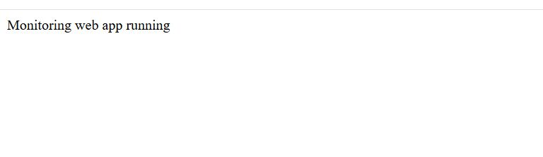
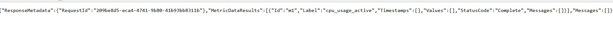
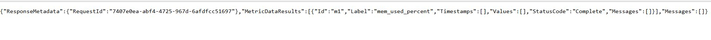
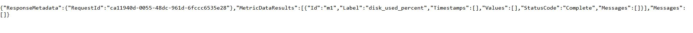
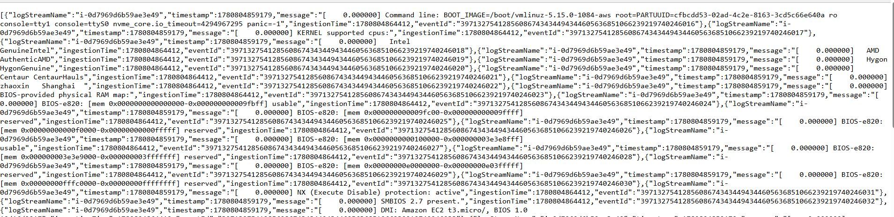

# EC2 Monitoring + Fargate Web UI

This repo creates:
- Terraform-managed infra: VPC, public subnet, EC2 instances (CloudWatch agent), ECR, ECS Fargate service.
- A small Node.js web app that queries CloudWatch metrics & logs.
- GitHub Actions workflow to build/push Docker image to ECR and force-deploy ECS service on push to main.

Usage:
1. Configure AWS credentials (env or AWS profile).
2. Edit terraform/variables.tf defaults if needed.
3. cd terraform && terraform init && terraform apply
4. Note ECR repo URL and ECS cluster/service outputs.
5. Push code to GitHub main; CI will build/push image and update ECS.

# Outputs

http://34.204.50.218:3000/

http://34.204.50.218:3000/metrics/i-022908cba071707ea/cpu_usage_active

http://34.204.50.218:3000/metrics/i-0f20790d59711caa6/mem_used_percent

http://34.204.50.218:3000/metrics/i-022908cba071707ea/disk_used_percent

http://34.204.50.218:3000/logs/dmesg

